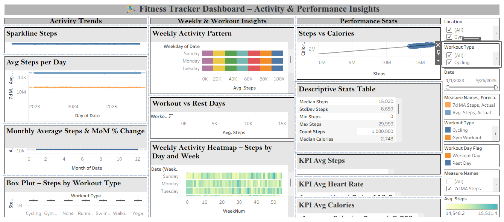

# 📊 Fitness Tracker Data Analysis (Tableau Project)

## 📌 Project Overview
This project analyzes fitness tracker data using Tableau to understand activity patterns, calories burned, and heart rate trends.

The dashboard provides insights into:
- Daily and monthly step trends
- Calories vs Steps correlation
- Weekly activity patterns
- Workout vs Rest day comparison
- KPI metrics

## 🛠 Tools Used
- Tableau
- Excel
- Kaggle Fitness Dataset

## 📷 Dashboard Preview

## 📈 Key Insights
- Activity levels are higher on weekends
- Strong positive relationship between steps and calories burned
- Weekly patterns visible through heatmap analysis
- Workout days show higher step counts than rest days

## 📁 Files in this Repository
- `Fitness_Tracker_Project.twbx` → Tableau dashboard file
- `screenshots/` → Dashboard images
- `Data/` → Dataset files (if included)

## 🚀 How to Open
1. Download the `.twbx` file
2. Open in Tableau Desktop
3. Explore the interactive dashboard
